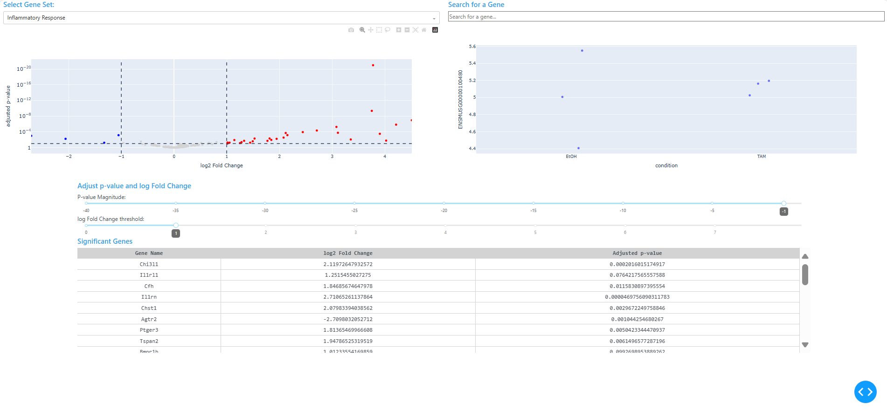

This project showcases a Python-based dashboard for visualizing differential gene expression results interactively. Built with Plotly Dash, the app renders volcano plots that respond to user-defined thresholds for adjusted p-value and log2 fold change. Users can filter by GO terms, search for specific genes, and click on individual points to reveal expression patterns across conditions.

The dashboard is designed to be modular and reproducible. It opens automatically in a browser window and supports dynamic filtering, gene highlighting, and click-based drilldowns. The app is built to accept any compatible dataset with DESeq2 results, normalized counts, and GO term annotations.

---

### Project Summary

I developed a Plotly Dash dashboard to explore differential expression results interactively. The app loads three user-provided CSV files:

- `DESeq2.results.csv`: differential expression results with `padj`, `log2FoldChange`, and `gene_name`
- `norm_counts.csv`: normalized count data across samples
- `GOterm.csv`: gene-to-GO term mappings

The dashboard transposes the count matrix, infers sample conditions, and renders a volcano plot that updates based on user input. Sliders control significance thresholds, dropdowns filter by GO terms, and a search bar highlights specific genes. Clicking a point reveals a strip plot of expression across conditions.

The layout uses Dash Bootstrap Components for a clean UI, and the app launches automatically in a browser window using Python’s `webbrowser` and `threading` modules.

---

### Tools & Skills

- Programming: Python (Dash, Plotly, NumPy, pandas)
- Visualization: Volcano plots, strip plots, dynamic filtering and highlighting
- Libraries: Dash, Plotly Express, Dash Bootstrap Components, Dash DataTable
- Bioinformatics Context: Differential expression, GO term filtering, gene-level drilldown

---

### Example Visualization

---